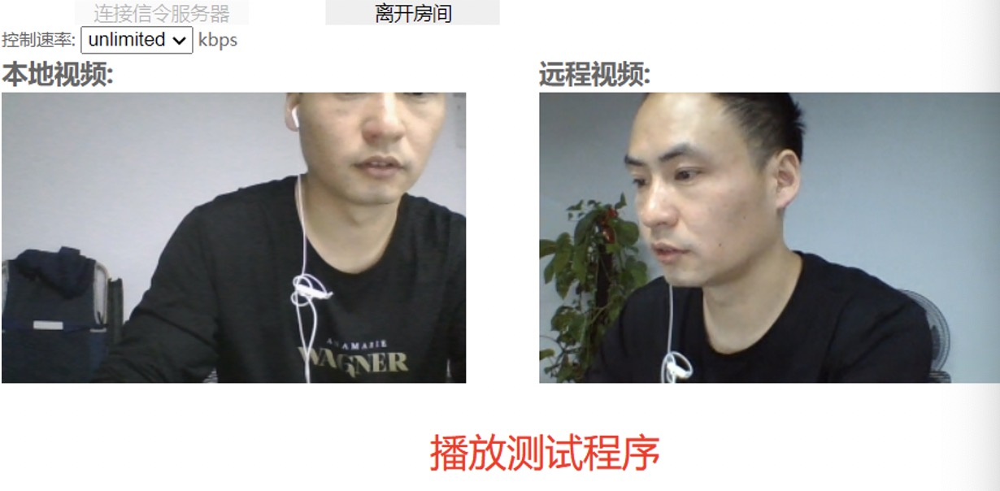

# 基于go语言的信令服务器

- 主要用于视频会议
- 主要用于直播
- 主要用于聊天

# STUN/TURN服务器搭建

- 服务器选型

  - rfc5766-turn-server
  - coTurn 选择coTurn
  - ResTurn

- coTurn服务器搭建与部署

  - 下载coTurn  git clone https://github.com/coturn/coturn
  - ./configure --prefix=/usr/local/coturn
  - 编译make && make install

- coTurn服务器配置项

  ```shell
  listening-port=3478 #指定监听端口
  external-ip=39.105.185.198#指定云主机的公网ip地址
  user=aaaaaaa:bbbbbbb#访问 stun/turn服务的用户名和密码 webrtc:123456
  realm=stun.xxx.cn #域名,这个一定要设置 turn.mostyour.com
  ```

- ./coturn/binturnserver -c ./etc/turnserver.conf 启动

- docker 安装

  - https://github.com/coturn/coturn/tree/master/docker/coturn

  - ```shell
    docker run -d --network=host -p 3478:3478 -p 3478:3478/udp -v $(pwd)/mycoturn.conf:/my/coturn.conf  coturn/coturn -c /my/coturn.conf
    ```

- 配置文件

  - https://github.com/coturn/coturn/blob/master/docker/coturn/turnserver.conf

- 测试 https://webrtc.github.io/samples/src/content/peerconnection/trickle-ice/

# 实现的效果


